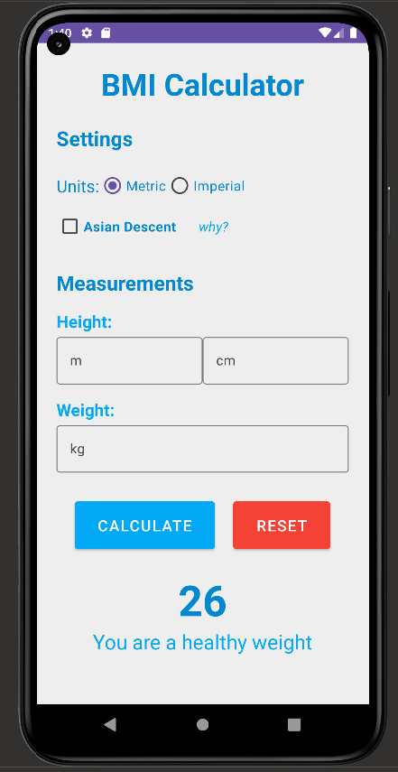

# BMI Calculator

##Introduction

This is the first android app I have developed. It is a simple BMI calculator that allows users to calculate their BMI based on their height and weight. The app is developed in Kotlin, making use of the Android SDK.

## Features

- Support for both Metric and Imperial systems.
- BMI categorization based on the World Health Organization's data.
- Asian descent evaluation of BMI.
- User-friendly interface with error checking for invalid inputs.

## Technologies Used

- **Kotlin:** The app is completely written in Kotlin.
- **XML layouts:** Used to create the user interface and handle user interaction.

## Screenshots (might be outdated)



## What I Learned

- How to use the Android SDK to create a user interface.
- How to handle user interaction.
- How to hide and show the keyboard.
- Getting values of the EditText, RadioGroup, and CheckBox.

## Installation

The project can be cloned from GitHub and opened in Android Studio.

```bash
git clone https://github.com/prosperinweb/bmi-calculator.git
